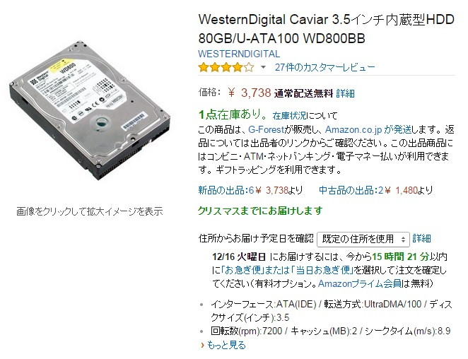
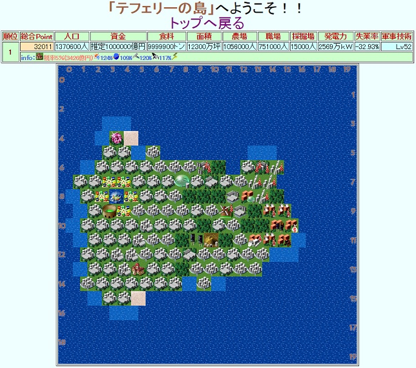
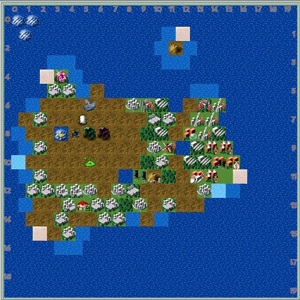
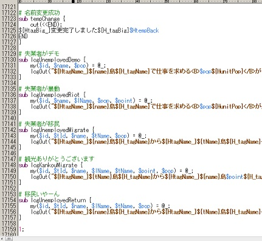

この記事は[OUCC Advent Calendar](http://www.adventar.org/calendars/449)の15日目です。

こんにちは、くろせ(@kurose_th)です。
あんまり書くネタも無いので、最近のことでも適当に書いておきます。あんまり技術ネタはないです

## 1. HDDが転がってた
中学か高校くらいの時に使ってて大学入った瞬間に動かなくなったPCのHDDが部屋にずっと転がってました。

（こんなの。80GBとか今ならSteamだけで消し飛ぶレベル。）

当初は中身のサルベージをする気はなかったのですが、最近突然気になってきたので中身を回収することにしてみることに。
HDDは規格が主に二種類（[SATAとIDE](http://pcsket.com/hdd/kikaku/)）あるそうで、このHDDは今使っているPCと違う規格でした。
というわけでAmazon先生で変換ケーブルﾎﾟﾁｰ。
おねだんは1.5kでした。思ってたより安かったです。
運良くHDD自体は生きていたので、USBで繋いだら至ってスムーズに中身を読み込んでくれました。
古いHDDをお持ちの方は、変換ケーブルを使って過去を覗きに行ってみてはどうでしょうか（あんまりオススメはしない）

## 2. ひさびさにPerl読んだ
上のHDD復活から繋がる話です。
自分がそもそもプログラムを触り始めたのは、CGIゲームにハマってた頃があったからでした。
CGIゲームはその名の通りCGIを利用したゲームで、基本的には
1. ゲームの作者がスクリプトを公開する
2. それをサイト運営者がDLして、自分のサイトに設置する
3. サイト運営者のページにユーザが行って遊ぶ

というステップを踏んでいました。
また、大体のゲームは改造（コードの書き換え）が許可されており、ベースは同じでもサイト毎に異なる仕様のゲームになっていた記憶があります。（今で言うゲームMOD的な）
「元のソースは配られてるんだし、自分でそれを読めたら最強プレイヤーじゃん？」みたいなことを考えてた頃が自分にもあったのですが、復活させたHDDにその残骸が眠っていました。

（cgiゲームの一例。復活させたので久々に遊んでるの図）

（その後、怪獣が出てきて一瞬で廃墟になりました）

元コードを久々に見ると一つの.cgiファイルに17000行とかあってoh...となったり、変数が訳判らんことになってたり（perlは何時でも新たな変数が使えるので、ちゃんと考えないと恐ろしいことになります）と地獄を見ました。

（ターン制ゲームの1ターン分の処理を全部押し込んだら行数がヤバイでござるの巻）

話のオチは殆どないんですが、HDDの中身を漁ってるとたまにｳｯとなることがあって精神的に良くなかったです。
あと、上のゲームの図は127.0.0.1上で動かして撮ったものです。
当時はhttpd + ActivePerlの組み合わせでPerl製CGIを動かしていたのでそれをそのままパクったのですが、もっと楽な方法があるかもしれません。

（ちなみに、当時のCGIゲームサイトはInfoseekのサービスであるIsweb上で展開されていたものが結構あり、それらは[Iswebが消滅すると同時に](http://ja.wikipedia.org/wiki/Infoseek_isweb#isweb.E3.81.AE.E7.B5.82.E4.BA.86)跡形もなく消えていきました。）

## 3. すごい研究たのしく進捗！
ダメです
卒論むりっすね〜と言いながら頑張ってます
ちなみに今使っている計算パッケージは落ちた時にまともなエラーログを吐いてくれないので、スーパーエスパーバグ取りパワーが必要になっています（だいぶ慣れてきた）

## 4. いんぐれすぽちぽち
ゲームについてはいろんなサイトで死ぬほど語られてるだろうということで適当に感想書いておきます。
* お出かけの暇つぶしになります。
* やたら運動させられるので割と時間と体力食います。
* 無駄に周辺地理と歴史（[とローソンのある位置](http://www.lawson.co.jp/campaign/static/ingress/)）に詳しくなります。
* なんか膝痛い。

（えんらいてんどでぼくと握手!）

## 5. 迷路の終わり/Maze's End
というわけで他の方が真面目な記事を投げるなか、クソみたいな自分語り記事を書いてしまいましたが（ごめんなさい）OUCCアドベントカレンダーでクリスマスを楽しみにお待ちください。

クリスマスBGMは[デススマイルズ2のJoy to the Worldアレンジ](https://www.youtube.com/watch?v=Pp-MbxCN7FE#t=44)がオススメです。

16日目となる明日は[すたーさん](http://www.adventar.org/users/5226)の記事です。
ではでは